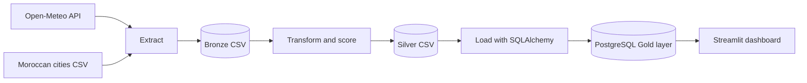
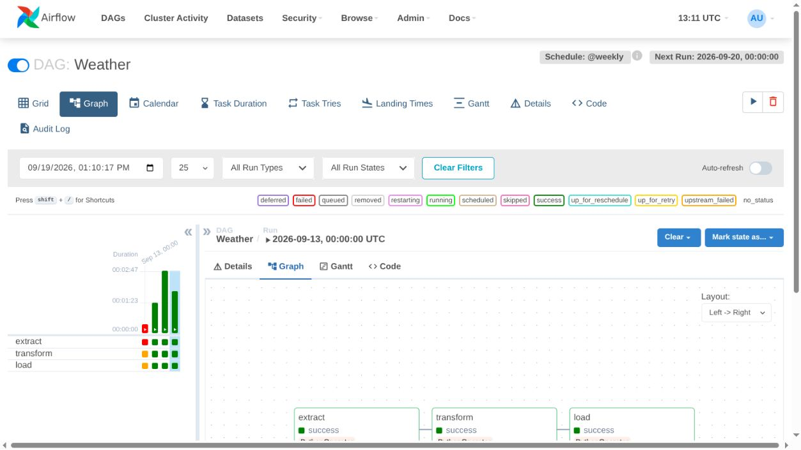
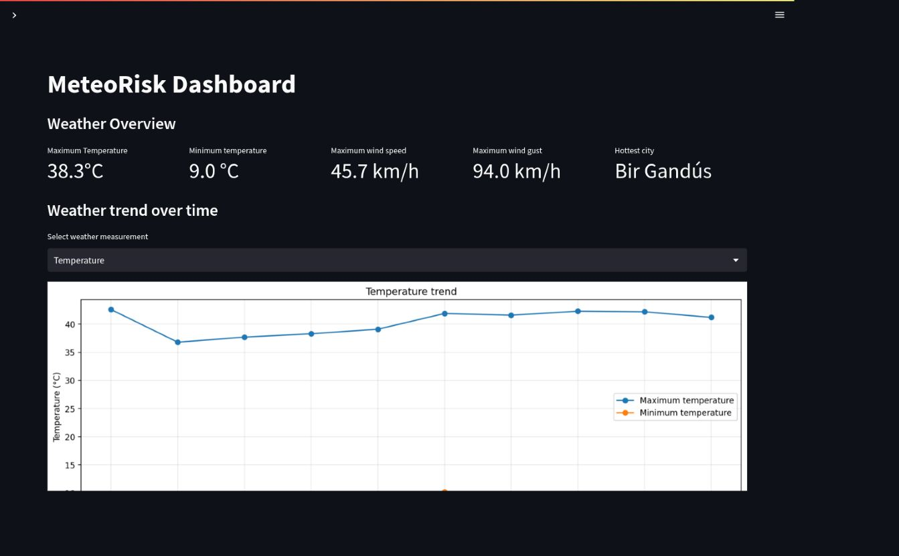
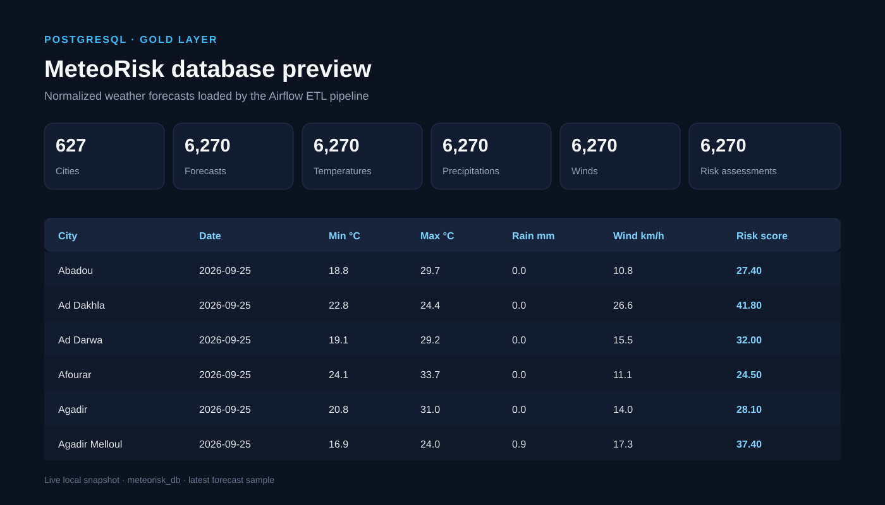

# MeteoRisk

MeteoRisk is an end-to-end weather analytics project for Moroccan cities. It collects forecast data from Open-Meteo, cleans and enriches it through an Airflow ETL pipeline, stores the analytical model in PostgreSQL, and presents the results in a Streamlit dashboard.

## Architecture



The weekly Airflow DAG runs three tasks in order: `extract → transform → load`.

## Project preview

### Airflow pipeline



### Streamlit dashboard



### PostgreSQL data



The database snapshot above was generated from the local `meteorisk_db` instance. It currently contains 627 cities and 6,270 forecasts, with related temperature, precipitation, wind, and risk records.

## What the project does

- Retrieves daily forecasts for Moroccan cities from Open-Meteo.
- Saves the raw API result in the Bronze data layer.
- Cleans types, fixes invalid minimum/maximum pairs, removes duplicates, and calculates risk and weather scores.
- Categorizes temperature, precipitation, and wind conditions.
- Saves the transformed dataset in the Silver data layer.
- Loads a normalized Gold model into PostgreSQL with SQLAlchemy.
- Provides date and city filters, KPI cards, time-series trends, scatter analysis, and category distributions in Streamlit.

## Data layers

| Layer | Storage | Purpose |
|---|---|---|
| Bronze | `data/bronze/bronze_meteo_data.csv` | Raw forecasts returned by Open-Meteo |
| Silver | `data/silver/gold_meteo_data.csv` | Cleaned, scored, and categorized data |
| Gold | PostgreSQL `meteorisk_db` | Normalized tables used by the dashboard |

The Silver filename is retained for compatibility with the current implementation; PostgreSQL is the project's Gold layer.

## Database model

`cities` has a one-to-many association with `forecasts`. Each forecast has one temperature, precipitation, wind, and risk-assessment record.



## Technology stack

- Python and Pandas for data processing
- Apache Airflow for orchestration
- PostgreSQL for analytical storage
- SQLAlchemy for database access
- Streamlit and Matplotlib for the dashboard
- Docker Compose for the local environment
- Jupyter for exploration

## Run locally

### Requirements

- Docker Engine
- Docker Compose v2

### Start the stack

```bash
git clone git@github.com:amineelhailaa/MeteoRisk.git
cd MeteoRisk
docker compose up --build -d
```

Open the services:

| Service | URL | Local credentials |
|---|---|---|
| Airflow | [http://localhost:8080](http://localhost:8080) | `admin` / `admin` |
| Streamlit | [http://localhost:8501](http://localhost:8501) | None |
| Jupyter | [http://localhost:8888](http://localhost:8888) | Token shown in container logs |
| PostgreSQL | `localhost:5432` | Configured in `compose.yaml` |

The credentials in `compose.yaml` are for local development only. Use secrets and strong passwords for any shared or deployed environment.

### Run the pipeline

1. Sign in to Airflow.
2. Open the `Weather` DAG.
3. Enable the DAG if it is paused.
4. Trigger a run and verify that `extract`, `transform`, and `load` succeed.
5. Open Streamlit to explore the loaded data.

The DAG is also scheduled with `@weekly` and has catch-up disabled.

## Repository structure

```text
MeteoRisk/
├── dags/                 # Airflow DAG definitions
├── data/
│   ├── bronze/           # Raw city and weather files
│   └── silver/           # Cleaned and enriched weather data
├── data_analyst/         # Streamlit dashboard
├── extraction/           # Open-Meteo client and extraction logic
├── transformation/       # Cleaning, scoring, and categories
├── load/                 # SQLAlchemy models and PostgreSQL loader
├── init/                 # PostgreSQL initialization
├── diagrammes/           # Domain model diagram
├── Dockerfile.airflow
└── compose.yaml
```

## Troubleshooting

### Airflow DAG is missing: `ModuleNotFoundError`

Airflow automatically adds `/opt/airflow/dags` to its Python path, but this project mounts `extraction`, `transformation`, and `load` directly under `/opt/airflow`. Without the project root in `PYTHONPATH`, the DAG cannot import those packages and may disappear from the Airflow UI.

The Airflow service must include:

```yaml
environment:
  - PYTHONPATH=/opt/airflow
```

After changing this setting, recreate the container:

```bash
docker compose up -d --force-recreate airflow
```

### Airflow standalone login

For the current local standalone instance, use:

```text
Username: admin
Password: QWt5UA4Dvxp23hAW
```

Airflow can generate a new standalone password when its container or metadata is recreated. If the password above no longer works, retrieve the latest credentials from the startup logs:

```bash
docker compose logs airflow | grep -i -E "username|password"
```

These credentials are only for local development and must not be reused in a deployed environment.

### Airflow does not start because of a stale PID

A previous webserver process may leave `/opt/airflow/airflow-webserver.pid` behind. Airflow then incorrectly reports that the webserver is already running, even though the recorded process is dead.

This commonly happens when the entire `/opt/airflow` directory is stored in a Docker volume. This project persists only `/opt/airflow/logs`, preventing runtime PID files from surviving container replacement.

Recreate the Airflow container to clear its temporary filesystem:

```bash
docker compose stop airflow
docker compose rm -f airflow
docker compose up -d airflow
```

Renaming the Dockerfile alone does not remove a stale PID. If the Dockerfile or dependencies changed, rebuild as well:

```bash
docker compose up --build -d --force-recreate airflow
```

## Development notes

Source-code changes are visible through the mounted Docker volumes. Rebuild the image after changing a Dockerfile or Python dependencies.

Useful commands:

```bash
# View container status
docker compose ps

# Follow logs
docker compose logs -f airflow
docker compose logs -f streamlit

# Rebuild after dependency or Dockerfile changes
docker compose up --build -d
```
